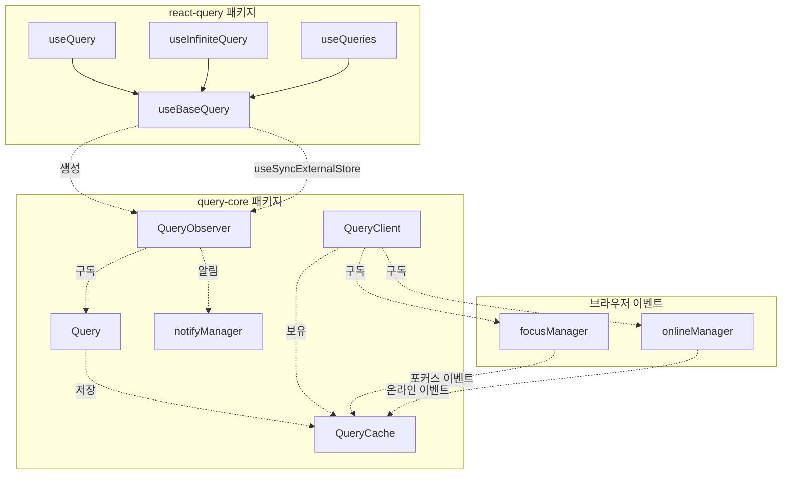
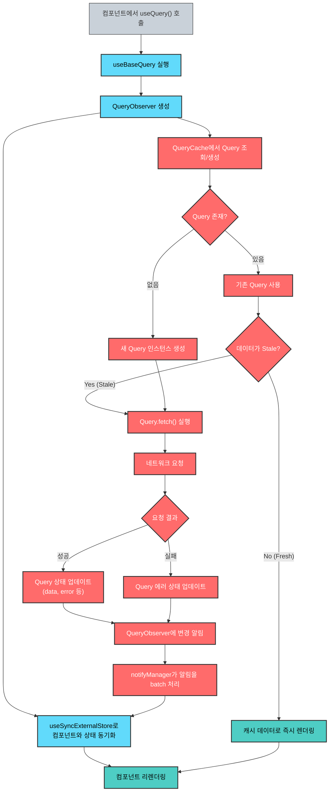
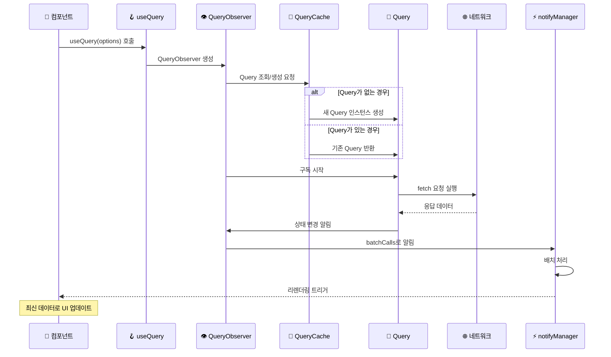
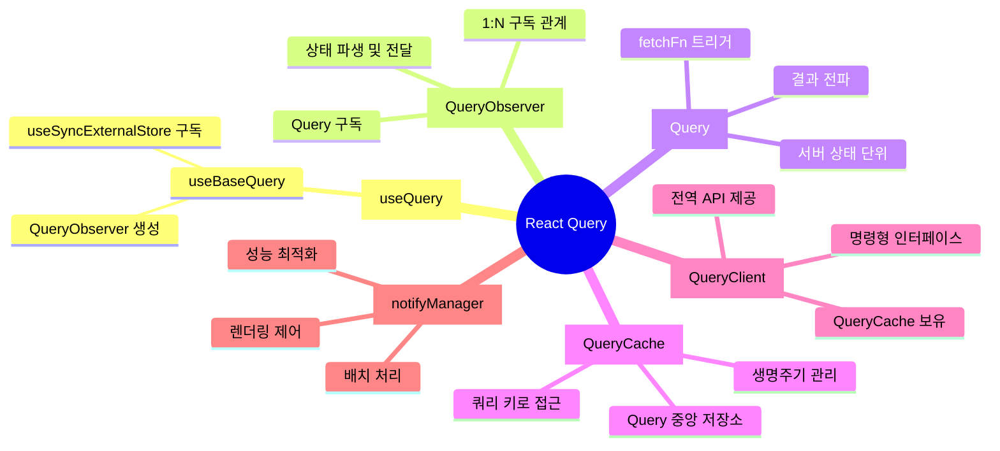

> React Query v5(TanStack Query)의 내부 구조와 동작 원리를 심층 분석하여, 더 효율적인 서버 상태 관리를 위한 인사이트를 제공합니다.

## 들어가며

React Query는 비동기 상태 관리 라이브러리로서 리액트 개발에서 서버 상태 관리의 사실상 표준처럼 사용되고 있습니다. 하지만 `useQuery()`를 사용하다 보면 내부에서 어떤 마법이 일어나는지 궁금해집니다. [김정환님의 블로그](https://jeonghwan-kim.github.io/2025/05/11/how-react-query-works)를 참고하여 React Query의 내부 동작을 체계적으로 분석해봤습니다.

## 아키텍처 개요

React Query는 크게 두 개의 패키지로 구성됩니다

| 패키지 | 역할 | 주요 구성 요소 |
| --- | --- | --- |
| **react-query** | UI 프레임워크 통합 | `useQuery`, `useBaseQuery`, React 훅들 |
| **query-core** | 핵심 비즈니스 로직 | `QueryObserver`, `Query`, `QueryCache`, `QueryClient` |

구조를 시각적으로 나타내 보겠습니다.



## 핵심 구성 요소 분석

### 1\. useQuery() 훅의 역할

| 특징 | 설명 |
| --- | --- |
| **함수 오버로딩** | 다양한 타입의 옵션을 받을 수 있도록 3가지 시그니처 제공 |
| **단순한 구조** | 실제로는 `useBaseQuery()`에 `QueryObserver` 클래스를 전달하는 역할만 |
| **코드 라인** | 약 50줄의 매우 간결한 구현 |

```typescript
// useQuery의 핵심 구조
function useQuery(options, queryClient) {
  return useBaseQuery(options, QueryObserver, queryClient)
}
```

### 2\. 전체 데이터 흐름 과정

React Query의 전체 동작 흐름을 한눈 보기



### 3\. useBaseQuery()의 핵심 역할

| 단계 | 작업 내용 | 코드 예시 |
| --- | --- | --- |
| **1\. 클라이언트 설정** | QueryClient 획득 및 옵션 병합 | `const client = useQueryClient(queryClient)` |
| **2\. 옵저버 생성** | QueryObserver 인스턴스 생성 | `const [observer] = useState(() => new Observer(client, options))` |
| **3\. 구독 설정** | 외부 스토어 구독으로 리액트와 동기화 | `useSyncExternalStore(...)` |
| **4\. 결과 반환** | 최적화된 결과 객체 반환 | `observer.trackResult(result)` |

### 4\. 시퀀스 다이어그램으로 전체 데이터 흐름 다시보기

컴포넌트부터 네트워크 요청까지의 상세한 상호작용 흐름을 확인해보겠습니다.



### 5\. QueryObserver - 리렌더링의 핵심

QueryObserver는 Query와 React 컴포넌트 사이의 가교 역할을 합니다.

| 기능 | 메서드 | 설명 |
| --- | --- | --- |
| **구독 관리** | `onSubscribe()`, `onUnsubscribe()` | 구독자 생명주기 관리 |
| **옵션 설정** | `setOptions()` | 쿼리 옵션 변경 및 재구성 |
| **데이터 패치** | `#executeFetch()` | 즉시 데이터 페칭 실행 |
| **결과 최적화** | `trackResult()` | 불필요한 렌더링 방지 |
| **낙관적 업데이트** | `getOptimisticResult()` | 로딩 전 예상 결과 제공 |

### 6\. Query - 서버 상태의 단위

| 속성 | 타입 | 역할 |
| --- | --- | --- |
| **queryKey** | `QueryKey` | 쿼리 식별자 |
| **queryFn** | `QueryFunction` | 실제 데이터 페칭 함수 |
| **state** | `QueryState` | 현재 쿼리 상태 (data, error, status 등) |
| **observers** | `Set<QueryObserver>` | 구독 중인 옵저버들 |
| **promise** | `Promise` | 진행 중인 요청 프로미스 |

#### Query의 생명주기

| 단계 | 상태 | 설명 |
| --- | --- | --- |
| **1\. 초기화** | `idle` | 아직 실행되지 않은 상태 |
| **2\. 로딩** | `pending` | 데이터 페칭 중 |
| **3\. 성공** | `success` | 데이터 페칭 완료 |
| **4\. 실패** | `error` | 에러 발생 |

### 7\. QueryCache - 중앙 저장소

| 기능 | 메서드 | 설명 |
| --- | --- | --- |
| **저장/조회** | `get()`, `getAll()` | 쿼리 인스턴스 관리 |
| **검색** | `find()`, `findAll()` | 조건에 맞는 쿼리 검색 |
| **이벤트 처리** | `onFocus()`, `onOnline()` | 브라우저 이벤트 대응 |
| **구독 관리** | `subscribe()` | 캐시 변경 알림 |

### 8\. QueryClient - 전역 API 제공자

QueryClient는 명령형 API를 통해 쿼리를 제어할 수 있게 해줍니다.

> 개인적으로 QueryClient가 선언형으로 다룰 수 있게되면 좋겠다는 소박한 희망이 있습니다.

#### 데이터 조작 API

| 메서드 | 용도 | 사용 시점 |
| --- | --- | --- |
| `getQueryData()` | 캐시된 데이터 조회 | 컴포넌트 외부에서 데이터 접근 |
| `setQueryData()` | 캐시 데이터 직접 설정 | 낙관적 업데이트, 수동 캐시 조작 |
| `invalidateQueries()` | 쿼리를 stale 상태로 변경 | 데이터 새로고침 필요 시 |
| `refetchQueries()` | 쿼리 재요청 | 강제 데이터 갱신 |
| `removeQueries()` | 캐시에서 쿼리 제거 | 메모리 정리, 민감한 데이터 삭제 |

#### 프리페칭 API

| 메서드 | 설명 | 장점 |
| --- | --- | --- |
| `prefetchQuery()` | 미리 데이터 로드 | 사용자 경험 향상 |
| `ensureQueryData()` | 캐시 확인 후 필요 시 페치 | 중복 요청 방지 |

## 성능 최적화: notifyManager

React Query의 성능 최적화 핵심은 `notifyManager`입니다.

### 배치 처리 메커니즘

| 단계 | 함수 | 역할 |
| --- | --- | --- |
| **1\. 배치 시작** | `batch()` | 트랜잭션 시작 |
| **2\. 알림 큐잉(Queueing)** | `schedule()` | 알림을 큐에 추가 |
| **3\. 배치 실행** | `flush()` | 큐의 모든 알림을 한 번에 실행 |
| **4\. 다음 틱(Tick) 예약** | `scheduleFn()` | `setTimeout(callback, 1)` 기본값 |

### 렌더링 최적화의 효과

호출이 많을수록 최적화의 효과가 두드러집니다.

| 상황 | 배치 처리 없이 | 배치 처리 적용 |
| --- | --- | --- |
| **동시 쿼리 업데이트** | N번 렌더링 | 1번 렌더링 |
| **연속 상태 변경** | 각각 렌더링 | 마지막 상태만 렌더링 |
| **성능 영향** | 높음 | 최소화 |

## 구성 요소별 역할 요약

전체 구조를 마인드맵으로 정리해보겠습니다.



## 데이터 흐름 단계별 정리

간단한 표를 활용하여 전체 데이터 흐름을 단계별로 정리해보겠습니다.

| 순서 | 단계 | 주체 | 작업 |
| --- | --- | --- | --- |
| **1** | 호출 | 컴포넌트 | `useQuery()` 실행 |
| **2** | 초기화 | useBaseQuery | QueryObserver 생성 및 구독 |
| **3** | 쿼리 조회 | QueryObserver | QueryCache에서 Query 찾기/생성 |
| **4** | 데이터 페칭 | Query | 네트워크 요청 실행 |
| **5** | 상태 업데이트 | Query | 결과에 따른 상태 변경 |
| **6** | 알림 전파 | QueryObserver | 구독자들에게 변경 알림 |
| **7** | 배치 처리 | notifyManager | 렌더링 최적화 |
| **8** | 컴포넌트 업데이트 | React | 리렌더링 실행 |

## 성능 모니터링

React Query의 성능을 모니터링할 수 있는 지표

| 지표 | 확인 방법 | 목적 |
| --- | --- | --- |
| **캐시 히트율** | DevTools의 쿼리 상태 | 네트워크 요청 절약 |
| **렌더링 횟수** | React Profiler | 불필요한 렌더링 탐지 |
| **메모리 사용량** | 브라우저 DevTools | 메모리 누수 방지 |
| **네트워크 요청** | Network 탭 | 중복 요청 확인 |

## 결론

React Query의 내부 동작을 이해하면 다음과 같은 이점을 얻을 수 있습니다

| 영역 | 개선 효과 |
| --- | --- |
| **성능** | 불필요한 요청과 렌더링 최소화 |
| **디버깅** | 문제 발생 시 정확한 원인 파악 |
| **최적화** | 적절한 옵션 설정으로 앱 성능 향상 |
| **확장성** | 대규모 앱에서도 안정적인 상태 관리 |

**핵심 포인트:**

* **QueryObserver**가 Query와 컴포넌트를 연결하는 핵심 가교 역할
    
* **notifyManager**의 배치 처리로 렌더링 성능 최적화
    
* **QueryCache**를 통한 효율적인 중앙 집중식 상태 관리
    
* **명령형 API**로 컴포넌트 외부에서도 쿼리 제어 가능
    

React Query는 데이터 페칭 역할 뿐 아니라 정교하게 설계된 비동기 상태 관리 시스템입니다. 이러한 내부 구조를 이해하고 활용한다면, 더욱 효율적이고 안정적인 React 애플리케이션을 개발할 수 있습니다.

---

*참고:* [*리액트 쿼리, 내부는 이렇게 움직인다 - 김정환 블로그*](https://jeonghwan-kim.github.io/2025/05/11/how-react-query-works)