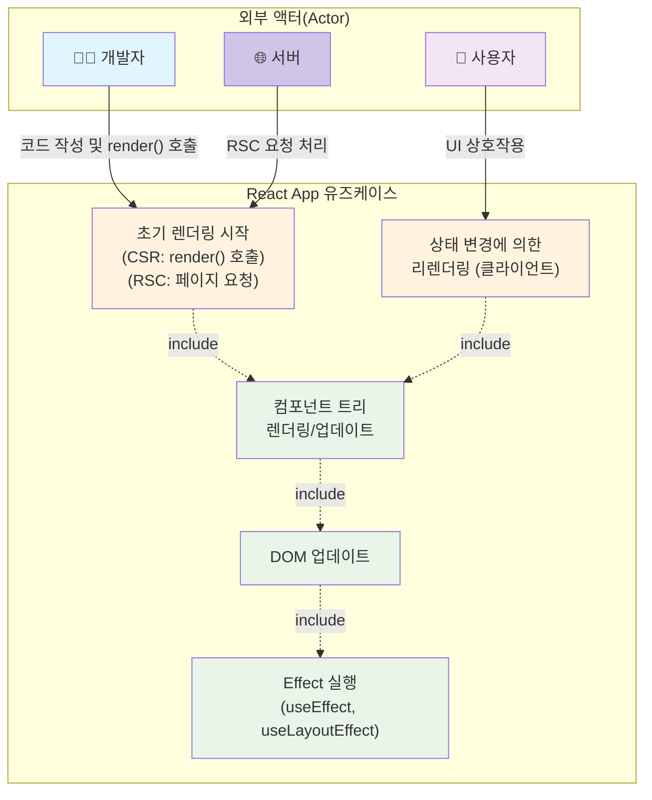
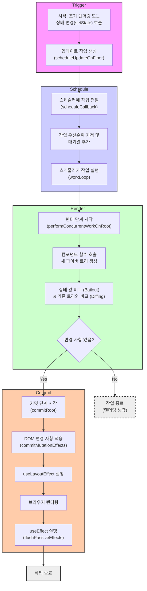
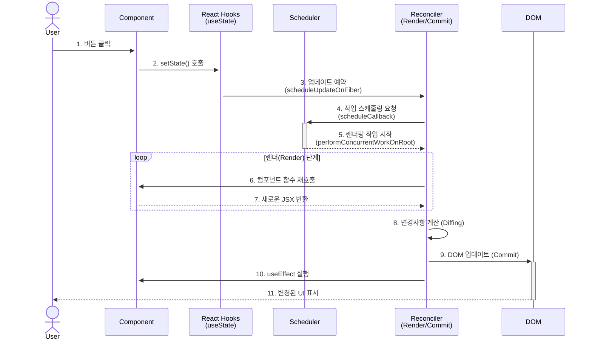
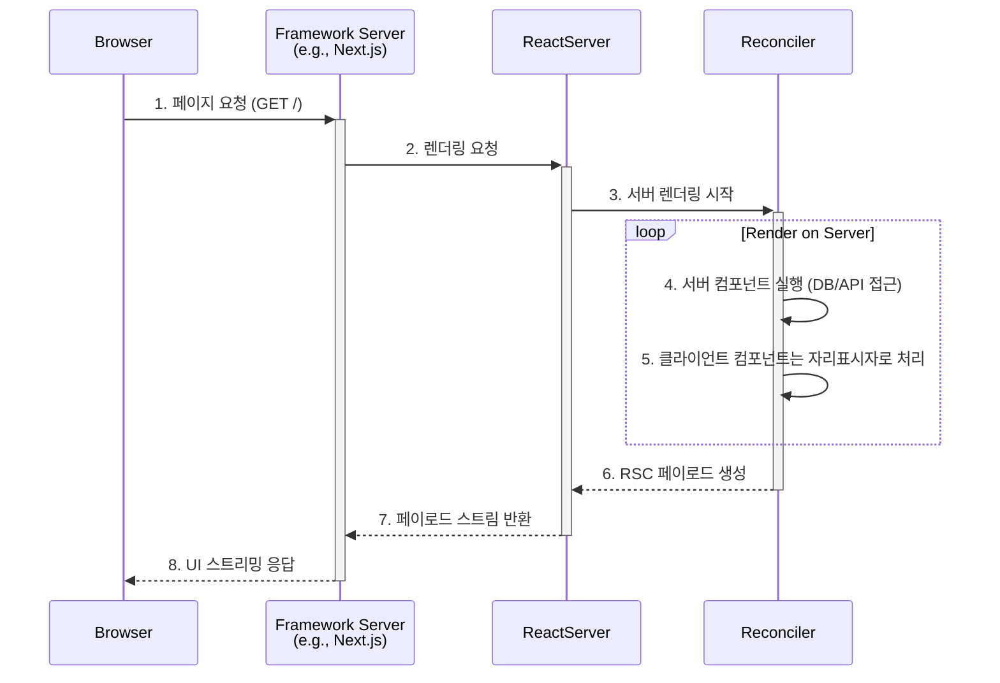
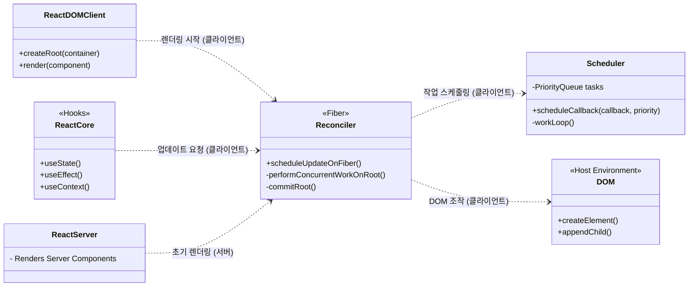

많은 개발자분들이 React를 사용하여 우아하고 동적인 사용자 인터페이스(UI)를 구현하지만, 정작 React가 내부적으로 어떻게 작동하는지에 대해서는 모르는 경우가 있습니다. React의 내부 동작 원리를 이해하면, 동작하는 코드를 작성하는 것을 넘어 더 효율적이고 최적화된 애플리케이션을 만들 수 있는 무기를 얻을 수 있습니다.

이 글에서는 React의 복잡한 내부 세계를 **서버 컴포넌트**와 **클라이언트 컴포넌트**의 상호작용을 중심으로 살펴보고, 특히 클라이언트에서의 동적 업데이트가 일어나는 과정을 트리거(Trigger), 스케줄(Schedule), 렌더(Render), 커밋(Commit)이라는 네 가지 핵심 단계로 나누어 설명합니다. 복잡도를 조금이나마 낮춰보기 위해 다양한 다이어그램을 활용해서 이해를 도왔습니다.

## React 내부, 어떻게 학습해야 할까?

React 내부 세계에 대해 설명하기 전에, React를 학습하는 방식에 대해 간단하게 정리해보고자 합니다. React의 코드베이스는 방대하고 복잡해서 어디서부터 시작해야 할지 막막할 수 있습니다. 바로 코드베이스를 보며 학습하기 보다 다음과 같은 효과적인 방식을 시도해보길 권장합니다.

1. **공식 문서 깊이 파기**: [React.dev](http://React.dev) 공식 문서(+블로그 포함)와 [React Working Group](https://github.com/reactjs/rfcs) 토론에는 React 핵심 팀의 철학과 의사결정 과정이 담겨있습니다. API 사용법을 넘어 그들의 생각을 읽는 것이 중요합니다.
    
2. **React 팀 팔로우하기**: React 팀원들의 소셜 미디어나 블로그를 팔로우하면 코드에는 드러나지 않는 귀중한 정보와 토론의 흐름을 파악할 수 있습니다. (트위터가 없어지며 팀원들이 다들 흩어져서 이 방식은 조금 어려워지긴 했습니다)
    
3. **React 레포지토리 탐색하기**: [React GitHub 레포지토리](https://github.com/facebook/react)의 코드뿐만 아니라, Pull Request(PR)와 코드 리뷰를 살펴보세요. 코드 주석(리액트 코드에는 설명용 주석이 많습니다)보다 더 상세한 구현 배경과 논의를 엿볼 수 있습니다.
    
4. **단순 블로그 글이 아닌 코드를 신뢰하기**: 인터넷의 수많은 글은 개념적인 설명에 그치는 경우가 많습니다.(이 글 포함) 실제 소스 코드를 직접 디버깅하고 분석하는 것이 가장 정확하게 이해하는 방법입니다.
    
5. **핵심 경로(Critical Path)부터 찾기**: 학습에 있어서 큰 덩어리로 시작하는건 효율적이지 않습니다. `useState`가 호출될 때부터 화면에 그려지기까지의 핵심적인 흐름을 먼저 파악한 뒤, 점진적으로 분할 정복을 하며 지식을 확장해 나가는 것이 효과적입니다.
    

## React 패키지 구조 엿보기

React 패키지 내부를 들여다보면, 최신 React가 어떻게 구성되어 있는지 명확하게 알 수 있습니다.

* **서버와 클라이언트의 분리**: react.react-server.js와 같은 파일들은 **서버 환경** 전용 빌드입니다. 반면, index.js 등은 **클라이언트(브라우저) 환경**을 위한 것입니다. 이는 React가 서버와 클라이언트에서 각기 다른 역할을 수행하도록 설계되었음을 보여줍니다.
    
* **클라이언트 렌더링 엔진**: useState, useEffect와 같은 훅(Hook)과 4단계 업데이트 로직은 클라이언트용 빌드에 포함된 Reconciler와 Scheduler가 담당합니다.
    
* **React 컴파일러 지원**: compiler-runtime.js 파일은 React 컴파일러(코드명: Forget)를 위한 런타임 코드로, 빌드 시점 최적화를 지원합니다.
    

이처럼 실제 패키지 구조는 우리가 논의할 서버/클라이언트 모델과 최적화 전략이 실제 코드 레벨에서 구현되어 있음을 증명합니다.

## React 업데이트는 누가, 어떻게 시작할까요?

React 업데이트는 **개발자**, **서버**, 그리고 **사용자**라는 세 주체에 의해 시작됩니다. 각 주체는 애플리케이션 생명주기의 다른 시점에서 업데이트를 유발합니다.

1. **개발자 (Developer)**: 모든 것의 시작점입니다. 개발자는 컴포넌트 구조와 렌더링 로직을 코드로 작성합니다. 특히 전통적인 클라이언트 사이드 렌더링(CSR)에서는 개발자가 작성한 `ReactDOM.createRoot().render()` 코드가 직접적으로 애플리케이션의 **첫 렌더링을 시작**시킵니다.
    
2. **서버 (Server)**: React 서버 컴포넌트(RSC) 환경에서는, 사용자의 페이지 요청을 받은 서버가 개발자가 작성한 코드를 실행하여 **초기 UI를 렌더링**합니다. 이는 서버에 의해 시작되는 업데이트입니다.
    
3. **사용자 (User)**: 애플리케이션이 로드된 후, 사용자는 버튼 클릭이나 입력 같은 상호작용을 통해 클라이언트 컴포넌트의 상태를 변경합니다. 이는 **후속 리렌더링을 유발(trigger)**합니다.
    

이 관계는 아래 유즈케이스 다이어그램으로 명확히 표현할 수 있습니다.

## 클라이언트 업데이트의 4단계 동작 원리

`'use client'`로 명시된 클라이언트 컴포넌트에서 발생하는 모든 업데이트는 아래 플로우차트에 나타난 **트리거 → 스케줄 → 렌더 → 커밋**의 4단계 과정을 거칩니다. 이 흐름은 React가 UI를 업데이트하는 핵심 로직입니다.

#### 1\. Trigger (트리거)

`render()`나 `setState()` 같은 이벤트가 발생하면, React는 어떤 컴포넌트를 다시 렌더링해야 할지 결정하고 업데이트 작업을 생성합니다.

#### 2\. Schedule (스케줄)

생성된 업데이트 작업의 우선순위를 정하고, 내부 스케줄러를 통해 언제 실행할지 결정합니다. 긴급한 업데이트는 먼저 처리(우선순위는 lane에 정의 되있습니다)하여 사용자 경험을 최적화합니다.

#### 3\. Render (렌더)

스케줄링된 컴포넌트를 실제로 렌더링하여 새로운 **파이버 트리(Fiber Tree)**를 구성하고, 기존 트리와 비교하여 변경 사항(diff)을 계산합니다. 이 단계는 실제 DOM을 건드리지 않으며, 더 급한 작업이 들어오면 중단될 수 있습니다.

#### 4\. Commit (커밋)

렌더 단계에서 계산된 변경 사항을 실제 DOM에 적용하는 마지막 단계입니다. 이 단계는 중단되지 않으며, DOM 업데이트 후 `useLayoutEffect`, 그리고 브라우저 페인팅 이후 `useEffect`를 순차적으로 실행합니다.

## 모듈 간의 상호작용

React 컴포넌트의 상호작용은 그것이 실행되는 환경(서버 또는 클라이언트)에 따라 크게 달라집니다.

### 1) 클라이언트 컴포넌트의 업데이트 상호작용

클라이언트 컴포넌트는 사용자의 상호작용(예: 버튼 클릭)에 의해 업데이트됩니다. 이 과정은 이전에 설명한 4단계(트리거 → 스케줄 → 렌더 → 커밋) 모델을 따르며, 최종적으로 실제 DOM을 변경하여 사용자에게 변경된 UI를 보여줍니다.

### 2) 서버 컴포넌트의 초기 렌더링 상호작용

서버 컴포넌트는 사용자의 최초 페이지 요청이나 내비게이션 요청에 의해 렌더링됩니다. 주된 목적은 데이터를 가져와 UI 구조를 생성하고, 이를 클라이언트로 스트리밍할 수 있는 특별한 형식(RSC Payload)으로 직렬화하는 것입니다.

이 과정은 사용자와의 상호작용이 없으며, 최종 결과물은 DOM 변경이 아닌 직렬화된 데이터입니다.

## React를 구성하는 핵심 모듈들

이 모든 마법은 React 내부의 핵심 모듈들이 유기적으로 협력하기에 가능합니다. 각 모듈의 역할과 관계를 **모듈 클래스 다이어그램**으로 확인 해보겠습니다.

* **ReactDOMClient**: `render()`를 통해 React 세계를 시작하는 진입점입니다.
    
* **ReactCore**: `useState`, `useEffect` 등 우리가 사용하는 훅을 제공합니다.
    
* **Scheduler**: 클라이언트 측 업데이트 작업의 우선순위를 관리하고 실행 시점을 조율합니다.
    
* **Reconciler**: 파이버(Fiber) 아키텍처를 기반으로 작동하는 React의 핵심 엔진입니다. 서버에서는 초기 렌더링을, 클라이언트에서는 변경 사항을 계산(Render)하고 DOM에 적용(Commit)하는 역할을 모두 수행합니다.
    
* **ReactServer**: 서버 환경에서 서버 컴포넌트를 렌더링하는 추상적인 주체입니다. 내부적으로 Reconciler를 사용하지만, Scheduler나 DOM 조작 로직은 사용하지 않습니다.
    

## 정리하며

최신 React는 **개발자**가 작성한 코드를 기반으로, **서버**와 **클라이언트**가 각자의 역할을 수행하는 하이브리드 모델을 구현합니다.

서버는 `react.react-server.js` 빌드를 사용해 초기 로딩과 데이터 페칭을 최적화하고, 클라이언트는 `index.js` 빌드를 통해 **트리거 → 스케줄 → 렌더 → 커밋** 과정을 거쳐 사용자와의 동적 상호작용을 처리합니다. 여기에 React 컴파일러가 더해져 렌더링 과정을 더욱 최적화합니다.

이 통합적인 동작 원리를 실제 패키지 구조와 연결하여 이해하면, 복잡한 애플리케이션의 성능을 어떻게 최적화할 수 있는지에 대한 깊이 있는 통찰력을 얻을 수 있습니다.