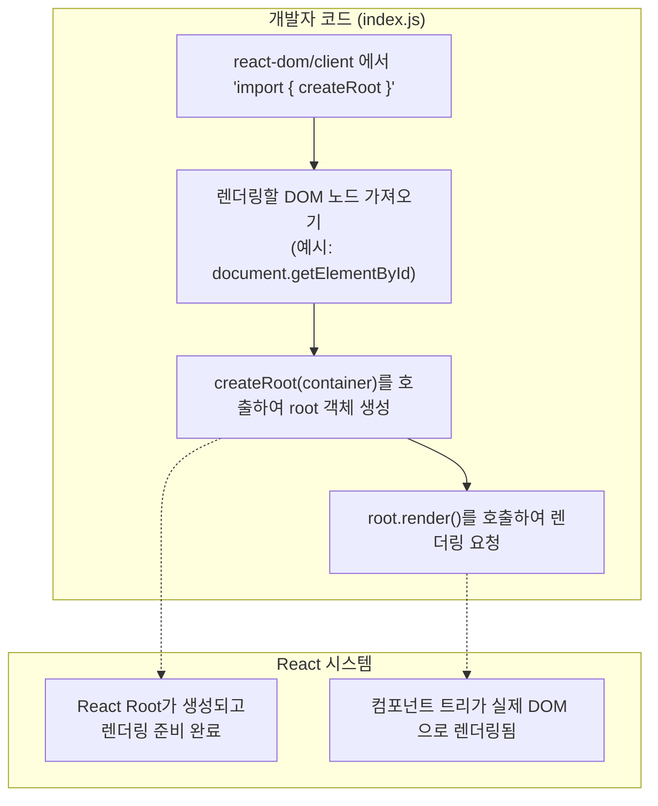
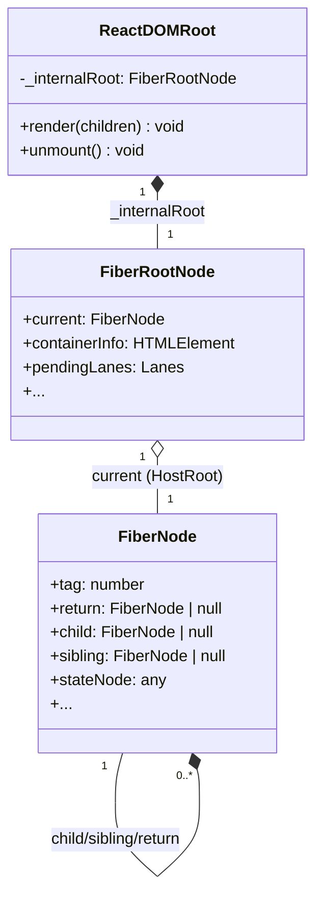
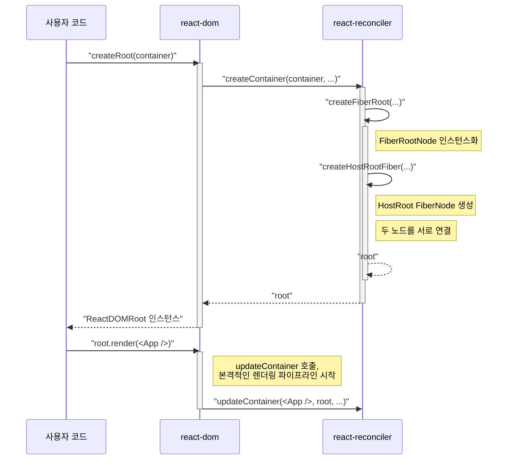

React는 어떻게 우리가 작성한 코드를 실제 눈에 보이는 DOM 요소로 변환할까요? React 18.2.0을 기준으로 내부 동작을 설명한 훌륭한 [아티클](https://ted-projects.com/react-internals-deep-dive-2)이 있지만, React 19가 릴리스되면서 많은 부분이 변경되었습니다. 특히 React Compiler의 도입과 같은 큰 변화가 있었죠.

이 글에서는 최신 React 19.1.0 버전의 소스 코드를 기반으로, React 애플리케이션이 최초로 화면을 그리는 **'초기 마운트(Initial Mount)'** 과정을 다이어그램과 함께 자세히 살펴보겠습니다.

## 1\. 개발자 관점의 시작: `createRoot`에서 `render`까지

모든 것은 개발자가 작성하는 몇 줄의 코드에서 시작됩니다. React가 내부적으로 복잡한 일을 하기 전에, 개발자는 어떤 순서로 React와 상호작용할까요? 다음 순서도는 개발자 입장에서의 전체적인 흐름을 보여줍니다.



이처럼 개발자는 단지 `createRoot`로 렌더링의 뿌리를 만들고, `render` 함수로 무엇을 그릴지 알려주기만 하면 됩니다. 이제부터 이 단순한 함수 호출 뒤에서 React가 어떤 일을 하는지 내부로 깊이 들어가 보겠습니다.

## 2\. React 내부 여정의 첫발: `createRoot`에서 `FiberRoot`까지

사용자가 `createRoot`를 호출하면, React는 렌더링 파이프라인을 시작할 준비에 들어갑니다.

### **1단계:** `createRoot` (in `react-dom`)

`packages/react-dom/src/client/ReactDOMRoot.js`에 위치한 `createRoot` 함수는 내부적으로 `createContainer` 함수를 호출하며, 각종 옵션을 설정하고 경고 메시지를 처리하는 역할을 합니다.

```javascript
// packages/react-dom/src/client/ReactDOMRoot.js
export function createRoot(container, options) {
  // ... 다양한 옵션 및 경고 처리 ...
  const root = createContainer(container, ConcurrentRoot, ...);
  // ... 이벤트 리스너 설정 등 ...
  return new ReactDOMRoot(root);
}
```

### **2단계:** `createContainer` & `createFiberRoot` (in `react-reconciler`)

핵심 로직은 `react-reconciler` 패키지에 있습니다. "Reconciler(조정자)"는 가상 DOM과 실제 DOM의 차이를 계산하고 업데이트를 관장하는 React의 core입니다.

`createContainer`는 내부에서 `createFiberRoot` 함수를 호출하여, React 애플리케이션의 근간이 되는 두 가지 핵심 객체를 생성합니다.

```javascript
// packages/react-reconciler/src/ReactFiberReconciler.js
export function createContainer(containerInfo, tag, ...) {
  const hydrate = false;
  const initialChildren = null;
  const root = createFiberRoot(
    containerInfo,
    tag,
    hydrate,
    initialChildren,
    ...
  );
  return root;
}
```

* `FiberRootNode`: 전체 애플리케이션 인스턴스에 대한 최상위 객체입니다. 렌더링할 DOM 컨테이너 정보, 현재 렌더링된 트리(`current`), 업데이트 큐(queue) 등 모든 상태를 총괄합니다. 앱 하나당 **단 하나만 존재**합니다.
    
* `HostRoot` FiberNode: `FiberRootNode`가 관리하는 Fiber Tree의 실제 시작점이 되는 특별한 종류의 `FiberNode`입니다.
    

```javascript
// packages/react-reconciler/src/ReactFiberReconciler.js
export function createFiberRoot(...) {
  const root = new FiberRootNode(containerInfo, tag, ...);
  // 👇 바로 이 부분에서 HostRoot 타입의 Fiber를 생성합니다.
  const uninitializedFiber = createHostRootFiber(tag, isStrictMode);
  // FiberRootNode가 자신의 'current' 속성으로 HostRoot Fiber를 가리키게 합니다.
  root.current = uninitializedFiber;
  // HostRoot Fiber는 자신의 'stateNode' 속성으로 FiberRootNode를 가리켜, 서로 참조하게 됩니다.
  uninitializedFiber.stateNode = root;
  // ...
  return root;
}
```

이 두 객체가 생성되고 서로 연결되면, React는 렌더링할 준비를 마치게 됩니다.

## 3\. 핵심 객체들의 관계 시각화하기

초기 마운트 과정에서 생성되는 주요 객체들의 관계를 클래스 다이어그램으로 살펴보면 구조를 더 명확하게 이해할 수 있습니다.



* 개발자가 받는 `ReactDOMRoot` 객체는 `_internalRoot` 속성을 통해 `FiberRootNode`를 소유합니다.
    
* `FiberRootNode`는 `current` 속성을 통해 현재 화면에 그려진 Fiber Tree의 최상단 `FiberNode`(즉, `HostRoot`)를 가리킵니다.
    
* 각 `FiberNode`는 `child`, `sibling`, `return` 포인터를 통해 트리 구조를 형성합니다.
    

## 4\. 함수 호출의 흐름 살펴보기

`createRoot` 호출부터 `root.render` 직전까지, 각 모듈이 어떤 순서로 통신하는지 시퀀스 다이어그램으로 확인해 보겠습니다.



`createRoot` 호출이 `react-dom`을 거쳐 `react-reconciler`에게 위임되고, 핵심 객체들이 생성된 후 다시 `ReactDOMRoot` 인스턴스로 포장되어 사용자에게 돌아오는 전 과정을 한눈에 볼 수 있습니다.

## 5\. 요약 및 다음 단계

지금까지 React 19에서 애플리케이션이 렌더링을 시작하기 전, 즉 **준비 단계**를 살펴보았습니다.

1. 개발자가 `createRoot`를 호출합니다.
    
2. `react-dom`은 `createContainer`를 통해 `react-reconciler`에게 루트 생성을 요청합니다.
    
3. `react-reconciler`는 `createFiberRoot`를 통해 앱의 상태를 총괄할 `FiberRootNode`와 Fiber Tree의 시작점인 `HostRoot FiberNode`를 생성합니다.
    
4. 모든 준비를 마친 `ReactDOMRoot` 인스턴스가 반환됩니다.
    

이 모든 과정은 `root.render(<App />)`가 호출되는 순간, 본격적인 **Render 단계**와 **Commit 단계**를 통해 우리가 작성한 컴포넌트를 실제 DOM에 그려주기 위한 빌드업이었습니다.

다음 글에서는 `render` 함수 호출 이후, React가 어떻게 Fiber Tree를 구축하고 DOM을 업데이트하는지에 대해 더 깊이 알아보겠습니다.