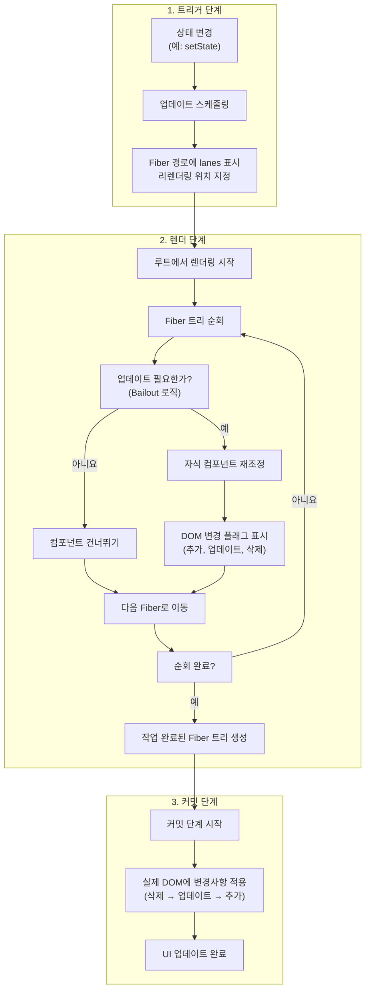
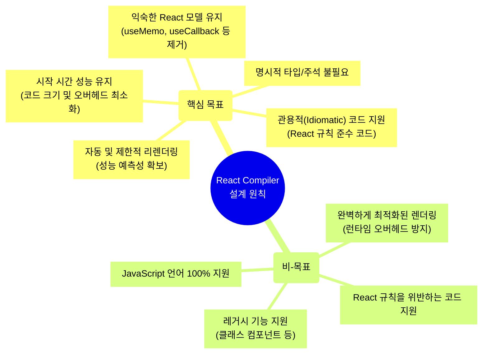
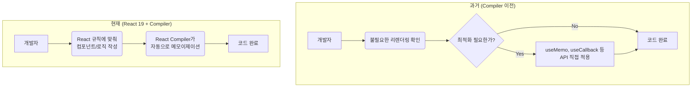

React 19가 등장하며 많은 개발자들이 'React Compiler'라는 혁신적인 기능에 주목하고 있습니다. 하지만 컴파일러가 정확히 무엇을, 어떻게 최적화하는지 이해하려면 먼저 React 19의 **표준 렌더링 파이프라인**을 알아야 합니다.

이 글에서는 React 19의 렌더링 과정을 두 단계로 나누어 설명합니다.

* **1부**에서는 모든 React 19 애플리케이션의 기본 동작인 **표준 렌더링 파이프라인**을 살펴봅니다.
    
* **2부**에서는 React Compiler가 이 표준 파이프라인 위에서 어떻게 자동으로 작동하여, 우리가 수동으로 하던 최적화 작업을 자동화하는지 보겠습니다.
    

---

## **1부: React 19의 표준 렌더링 파이프라인**

React 19의 기본적인 렌더링 과정은 이전 버전의 핵심 원칙을 계승합니다. 렌더링 과정은 크게 **트리거(Trigger)**, **렌더(Render)**, **커밋(Commit)** 세 단계의 파이프라인으로 이루어집니다.

> React 4가지 핵심 원칙 간단 정리
> 
> 1. 상태(state)가 UI를 결정한다: 개발자가 상태(state = data)를 바꾸면 UI는 알아서 바뀐다.
>     
> 2. 선언적 프로그래밍: UI가 어떤(what) 상태여야 하는지 선언한다.
>     
> 3. 재조정(Reconciliation): 가상의 UI 구조(virtual DOM)에서 변경 전후 차이점 비교로 재조정한다.
>     
> 4. 컴포넌트 기반 아키텍쳐: UI를 독립적이며 재사용 가능한 컴포넌트 단위로 조립한다.
>     

### **1\. 트리거(Trigger) 단계: 변경의 시작**

**"업데이트가 필요하다"는 사실을 인지하고 작업을 예약하는 단계입니다.**

* **시작점:** 사용자의 클릭 등으로 `useState`의 세터 함수가 호출되면서 시작됩니다.
    
* **작업 예약:** React는 이 업데이트가 얼마나 시급한지 판단하여 **우선순위**(`lanes`)를 매깁니다. 예를 들어, 버튼 클릭은 입력에 대한 즉각적인 피드백이 중요하므로 높은 우선순위를 갖습니다.
    
* **경로 표시:** 업데이트가 필요한 컴포넌트부터 최상위 루트(root)까지의 경로에 있는 모든 Fiber 노드(컴포넌트에 대한 정보 객체)에 `lanes`와 `childLanes`라는 플래그를 남겨, "이쪽 라인을 점검해야 해!"라고 표시합니다.
    

### **2\. 렌더(Render) 단계: 변경점 계산**

**"실제 DOM을 건드리지 않고, 가상으로 무엇이 변했는지 계산하는 두뇌 역할"** 을 하는 복잡하고 중요한 단계입니다.

* **재조정(Reconciliation):** React는 트리거 단계에서 표시된 경로를 따라 Fiber 트리를 순회하며 컴포넌트를 다시 실행합니다. 그리고 이전에 렌더링된 결과와 새로 생성된 결과를 비교합니다.
    
* **최적화 (Bailout):** 재조정 과정에서, 만약 어떤 컴포넌트의 props가 이전과 동일하고 상태 변경도 없다면, React는 "이 컴포넌트와 그 아래 자식들은 모두 변경점이 없겠구나"라고 판단합니다. 그리고 해당 컴포넌트와 그 하위 트리 전체의 렌더링 과정을 통째로 **"건너 뛰어(Bailout)"** 버립니다. 이것이 바로 React.memo가 수동으로 이끌어내는 핵심 최적화이며, 불필요한 계산을 막아 성능을 향상시킵니다.
    
* **변경 계획 수립 (플래그 표시):** 비교 결과 변경이 감지된 부분은 실제 DOM을 바로 바꾸는 대신, "이 노드는 DOM에 새로 **추가**해야 함(`Placement`)", "이 노드는 속성을 **수정**해야 함(`Update`)", "이 노드는 **제거**해야 함(`Deletion`)" 과 같이 해야 할 일들을 Fiber 노드에 **플래그로 기록**합니다. 이 플래그들이 모여 최종 \*\*'변경 계획서'\*\*가 됩니다. 이 때 변경 계획서는 Fiber 노드들의 집합인 **Fiber 트리**에 기록 되있습니다.
    

### **3\. 커밋(Commit) 단계: 실제 화면에 반영**

**렌더 단계에서 수립된 '변경 계획서'를 실제 DOM에 적용하여 사용자가 변경을 볼 수 있게 하는 마지막 단계입니다.**

* **계획 실행:** React는 렌더 단계에서 플래그가 표시된 모든 Fiber 노드를 찾아냅니다.
    
* **DOM 업데이트:** 이 플래그에 따라 DOM 노드를 추가, 수정, 삭제하는 실제 작업을 실행합니다. 이 과정은 화면 깜빡임 같은 현상을 막기 위해 동기적으로, 한 번에 일괄 처리됩니다.
    
* **작업 완료:** 모든 DOM 조작이 끝나면 렌더링 과정이 최종적으로 완료됩니다.
    

이것이 React 19의 **표준 렌더링 파이프라인**입니다.

### **React 19 표준 렌더링 파이프라인 시각화**

> 상태 변경부터 실제 UI 업데이트까지 이어지는 Trigger, Render, Commit 단계의 전체 흐름을 시각화합니다.

## **2부: React Compiler, 똑똑한 최적화의 등장**

그렇다면 React Compiler는 이 표준 파이프라인에서 어떤 역할을 할까요? 컴파일러는 **"렌더 단계를 더 똑똑하게 만드는 조력자"** 입니다. 먼저 컴파일러가 어떤 철학으로 설계되었는지 살펴보는 것이 중요합니다.

### **React Compiler 설계 원칙 (Goals & Non-Goals)**

> React Compiler의 핵심 설계 목표와, 의도적으로 제외된 비-목표를 시각화하여 프로젝트의 명확한 범위와 방향을 제시합니다.

차트에서 볼 수 있듯이, 컴파일러의 핵심 목표는 개발자가 `useMemo`, `useCallback` 같은 API를 직접 사용하지 않아도, **자동으로 코드를 분석하여 불필요한 리렌더링을 방지**하는 것입니다.

#### **어떻게 가능할까요?**

컴파일러는 빌드 시점에 코드를 미리 분석하여, **어떤 값이나 함수가 리렌더링 사이에 변하지 않을지 예측**합니다.

* **반응형 스코프(Reactive Scopes) 분석:** 컴파일러는 어떤 값들이 서로 의존하는지, 어떤 상태(state)가 변할 때 어떤 부분만 다시 계산하면 되는지를 파악하여 '반응형 스코프'라는 그룹으로 묶습니다.
    
* **자동 메모이제이션:** 분석이 끝나면, 컴파일러는 마치 개발자가 `useMemo`나 `useCallback`을 직접 추가한 것처럼 코드를 변환합니다. 이 변환된 코드는 렌더 단계에서 React의 **Bailout 최적화**를 극대화하여, 불필요한 리렌더링을 원천적으로 차단합니다.
    

### **개발자의 최적화 작업 변화 시각화**

> React Compiler가 도입되면서, 개발자가 수동으로 하던 최적화 작업을 컴파일러가 대신해주는 과정을 보여줍니다.

## **결론: 개발자는 로직에, 최적화는 React에 맡기자**

정리하자면, React 19의 렌더링 방식은 다음과 같습니다.

1. **기본적으로는 Trigger → Render → Commit 파이프라인을 따릅니다.**
    
2. **React Compiler는 이 파이프라인의 '렌더' 단계를 자동 최적화하여, 개발자가 수동으로 개입할 필요 없이도 최고의 성능을 내도록 돕습니다.**
    

이는 React의 핵심 철학인 'UI를 선언적으로 만드는 것'에 더 깊이 다가가는 중요한 변화입니다. React Compiler는 단순히 편의성을 높이는 것을 넘어, React 생태계 전체의 성능 기준을 한 단계 끌어올리는 혁신을 목표로 하고 있습니다. 만약 이 새로운 기능이 제대로 자리 잡게 된다면, 이제 React를 사용하는 개발자들은 최적화에 대한 고민을 React에 맡기고, 다른 영역에 좀 더 집중할 수 있는 여유(slack)을 가질 수 있게 될 것입니다.