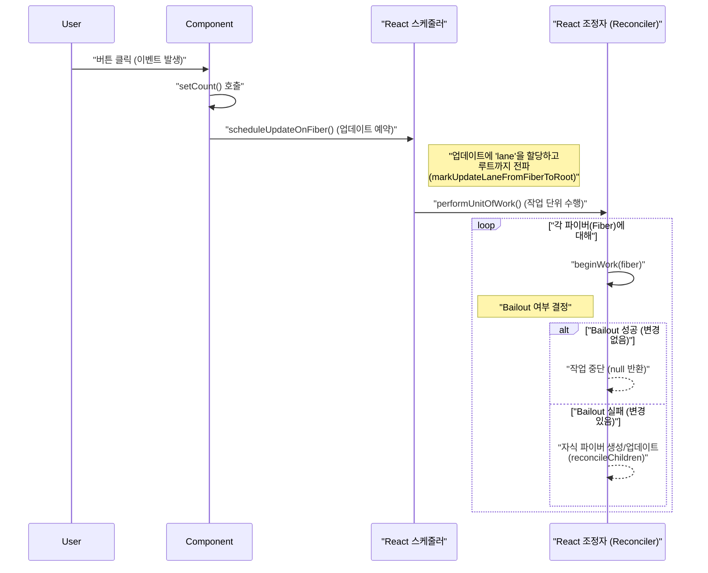
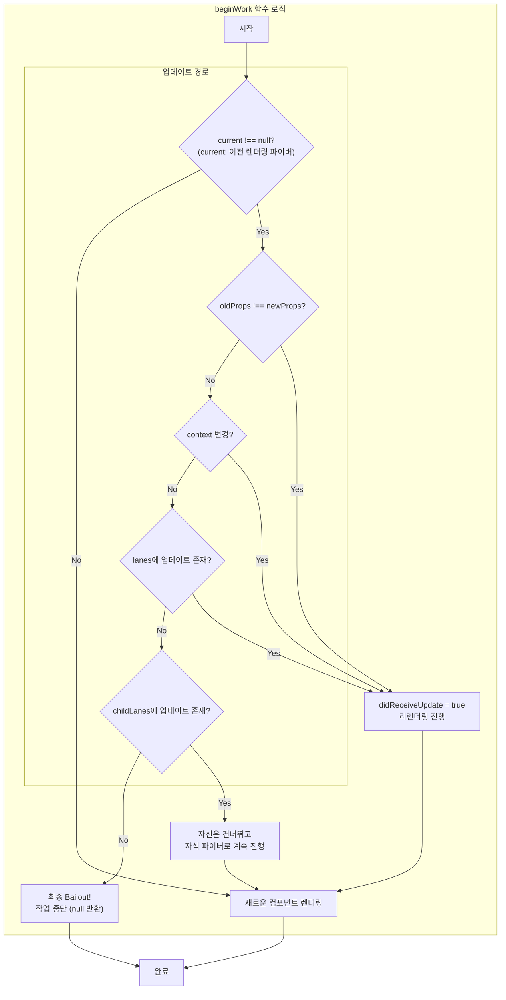

React를 사용하다 보면 마주치는 신기한 순간이 있습니다. 부모 컴포넌트의 상태가 변경되었는데, 자식 컴포넌트 전체가 아닌 특정 부분만 깜빡이며 업데이트됩니다. 어떻게 이런 일이 가능할까요?

이 현상의 중심에는 React의 성능 최적화 전략인 **"Bailout"** 이 있습니다. 말 그대로, React가 "이 컴포넌트는 변경점이 없으니, 렌더링 과정을 건너뛰자!"라고 결정하는 스마트한 메커니즘입니다.

이번 글에서는 이 Bailout이 어떤 원리로 동작하는지, 실제 React 소스 코드와 다이어그램을 통해 파헤쳐 보겠습니다.

### 수수께끼: 왜 일부만 리렌더링될까?

다음과 같은 컴포넌트 구조를 상상해 보세요.

```xml
// 우리의 컴포넌트 구조
<A>
  <B>
    <C>
      <button/>
      <D/>
    </C>
  </B>
  <E>
    <F/>
  </E>
</A>
```

여기서 컴포넌트 C 안의 버튼을 클릭해 상태를 변경하면, 놀랍게도 C와 D만 다시 렌더링됩니다. A, B, E, F는 아무런 변화가 없습니다. React는 어떻게 이 사실을 알고 최소한의 작업만 수행했을까요?

### 모든 것의 시작: `setState` 호출 시퀀스

사용자가 버튼을 클릭하여 `setState`를 호출하면 어떤 일이 벌어질까요? 렌더링이 일어나기까지의 과정을 Sequence Diagram으로 먼저 살펴보겠습니다.



이 다이어그램은 업데이트 요청이 어떻게 스케줄러를 통해 조정자(Reconciler)에게 전달되고, `beginWork` 함수가 각 컴포넌트(파이버)의 운명을 결정하는 핵심 역할을 하는지 보여줍니다.

### Deep Dive 1: 업데이트의 흔적, lanes와 Fiber 노드

React는 내부적으로 컴포넌트 트리를 **파이버(Fiber) 노드** 트리로 관리합니다. 각 파이버는 컴포넌트의 작업 단위이자 상태를 저장하는 장소입니다. `setState`가 호출되면 React는 이 파이버 노드에 흔적을 남깁니다.

* `lanes`: 상태 변경이 **직접** 일어난 파이버에 꽂히는 깃발(flag)입니다.
    
    * lane왈: "나 자신이 업데이트되어야 해!"
        
* `childLanes`: 상태 변경이 일어난 파이버의 **모든 부모**에게 꽂히는 깃발입니다.
    
    * childLane왈: "내 자식들 중에 업데이트가 필요한 녀석이 있어!"
        

이 속성들은 파이버 노드 객체 안에 존재합니다. 파이버 노드의 구조를 간단히 살펴보겠습니다.

### Deep Dive 2: Bailout의 관문, `beginWork` 소스 코드 분석

이제 하이라이트인 `beginWork` 함수의 실제 코드를 살펴보겠습니다. 이 함수가 어떻게 `props`와 `lanes`를 사용해 Bailout을 결정하는지 직접 확인해보겠습니다.

```javascript
// source: react-reconciler/src/ReactFiberBeginWork.js (일부 단순화)

function beginWork(current, workInProgress, renderLanes) {
  // 'current'는 이전 렌더링의 파이버입니다. null이 아니면 업데이트 상황입니다.
  if (current !== null) {
    const oldProps = current.memoizedProps;
    const newProps = workInProgress.pendingProps;

    // 1. props나 context가 변경되었는가? (참조 비교)
    if (oldProps !== newProps || hasContextChanged()) {
      // 변경되었으면 무조건 리렌더링 진행
      didReceiveUpdate = true;
    } else {
      // 2. props는 같다. 그럼 스케줄된 업데이트(lanes)가 있는가?
      const hasScheduledUpdate = checkScheduledUpdateOrContext(current, renderLanes);
      if (!hasScheduledUpdate) {
        // 3. 스케줄된 업데이트도 없다! 최종 Bailout 시도.
        // 이 함수 내부에서 childLanes를 확인하고 최종 결정을 내립니다.
        return attemptEarlyBailoutIfNoScheduledUpdate(current, workInProgress, renderLanes);
      }
      // ...
    }
  }

  // ...
  // Bailout 되지 않았다면, 컴포넌트 타입에 따라 렌더링 함수를 실행합니다.
  return updateFunctionComponent(current, workInProgress, ...);
}
```

이 코드의 논리를 Flowchart로 시각화하면 더욱 명확해집니다.



### 숨겨진 범인: 왜 아무 상관 없는 `<D/>`는 리렌더링될까?

이제 `D`가 리렌더링되는 이유를 코드 레벨에서 추적할 수 있습니다. `C`는 Bailout에 실패했으므로 `updateFunctionComponent`가 호출됩니다. 이 함수는 `C`의 렌더링 함수를 실행하여 `return <div...><D/></div>`를 통해 **새로운** `<D/>` 엘리먼트 객체를 만듭니다.

이 새 엘리먼트는 `D` 파이버의 `pendingProps`가 됩니다. 다음 차례에 `D`의 `beginWork`가 실행될 때, `oldProps !== newProps` 비교에서 두 객체의 메모리 주소가 다르므로 `true`를 반환하고, 결국 리렌더링으로 이어지는 것입니다.

### 아무 상관없는 컴포넌트 해결책: 참조를 동일하게 유지하라

이 문제를 해결하기 위해 개발자들은 props의 참조를 동일하게 유지하려는 다양한 **메모이제이션(memoization) 노력**을 해왔습니다. 단순히 자식 컴포넌트 자체를 `React.memo`로 감싸는 것뿐만 아니라, 자식에게 전달하는 props가 렌더링마다 새로 생성되지 않도록 막는 것이 핵심입니다.  
위와 같은 기법들의 공통 목표는 **"렌더링 시 불필요한 참조 생성을 막아 React의 Bailout 메커니즘이 효율적으로 동작하도록 돕는 것"** 입니다.

> **미래 엿보기: React 19와 React Compiler**
> 
> React 19부터 선택적으로 도입되는 React Compiler는 이 모든 과정을 자동화하는 것을 목표로 합니다. 컴파일러가 코드를 미리 분석하여 `<D />`와 같이 불필요하게 재생성되는 부분을 찾아내고, 자동으로 `React.memo`로 감싼 것과 같은 효과를 내도록 코드를 변환해줍니다. 아직은 실험적인 기능이지만, React의 개발 경험이 어떻게 진화할지 보여주는 흥미로운 방향입니다.

### 결론

React의 "Bailout"은 `props`의 참조 동일성과 내부적인 `lanes` 시스템을 기반으로 동작하는 정교한 최적화 메커니즘입니다. `beginWork`라는 관문을 통해 각 컴포넌트의 운명을 결정하며, 이 과정을 이해하는 것은 React의 성능을 최대로 끌어올리는 데 큰 도움이 됩니다.

우리가 작성하는 코드가 화면 뒤에서 어떻게 동작하는지 알 때, 우리는 더 나은 코드를 작성하고 예측 불가능한 버그를 더 쉽게 해결할 수 있기 때문입니다. 부족한 글 읽어주셔서 감사합니다.