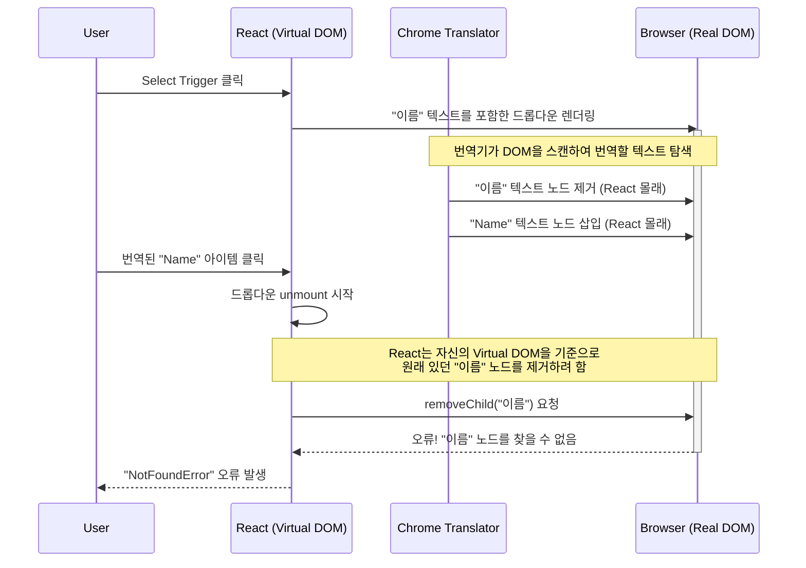

### 문제의 시작: 유령처럼 나타나는 DOM 오류

개발 후 QA과정에서 재현 조건이 까다로운 오류와 마주쳤습니다.

```xml
NotFoundError: Failed to execute 'removeChild' on 'Node': The node to be removed is not a child of this node.
```

React 개발자라면 한 번쯤 봤을 법한 이 오류는 일반적으로 React의 가상 DOM 상태와 실제 DOM 상태가 일치하지 않을 때 발생합니다. 하지만 이번 경우는 달랐습니다. 오류는 특정 사용자 그룹의 특정 상황, 바로 **Chrome의 '이 페이지 번역' 기능을 활성화했을 때만** 발생했습니다.

### 기나긴 디버깅 여정: 가설과 실패의 연속

이 문제를 해결하기 위해 여러 가설을 세우고 다양한 해결책을 시도했습니다.

1. **가설 1: React 상태 업데이트 경쟁 상태**
    
    * **시도**: `Select` 컴포넌트의 `onValueChange` 핸들러에서 여러 상태가 동시에 업데이트되면서 렌더링 충돌이 발생한다고 추측했습니다. `useTransition`과 `setTimeout`을 사용해 상태 업데이트에 지연을 주어 렌더링 타이밍을 분리하고자 했습니다.
        
    * **결과**: 실패. 오류는 여전히 발생했습니다.
        
2. **가설 2: 컴포넌트 레벨에서의 번역 차단**
    
    * **시도**: 문제가 Chrome 번역 기능에 있다는 것을 인지하고, 오류가 발생하는 Radix UI의 `SelectItem` 컴포넌트에 `translate="no"` 속성을 추가하여 해당 부분의 번역을 막으려고 시도했습니다.
        
    * **결과**: 실패. `SelectItem` 내부의 텍스트 노드는 여전히 번역기에 의해 수정되었고, 문제는 해결되지 않았습니다.
        
3. **가설 3: Radix UI의 Portal 시스템과 번역기의 충돌**
    
    * **시도**: Radix UI는 `Select`의 드롭다운 메뉴를 `document.body` 끝에 Portal을 사용해 렌더링합니다. 이 Portal 내부의 DOM이 번역기에 의해 조작되면서 충돌이 발생한다고 판단, Portal 기능을 제거하고 컴포넌트 내부에 직접 렌더링하도록 수정했습니다. 또한 `requestAnimationFrame`과 더 긴 `setTimeout` 지연(100ms)을 결합하여 타이밍 이슈를 해결하려 했습니다.
        
    * **결과**: 실패. 오류의 발생 빈도가 줄어드는 것처럼 보였지만, 근본적인 해결책은 아니었습니다. 오류는 결국 다시 발생했습니다.
        

### 근본 원인 분석: React의 예측을 배신하는 `<font>` 태그

모든 시도가 실패로 돌아간 후, 우리는 문제의 본질을 더 깊이 파고들었습니다. 원인은 **React의 가상 DOM**과 **Chrome 번역기가 실제 DOM을 조작하는 방식** 사이의 근본적인 불일치에 있었습니다. 특히, 한 커뮤니티 블로그 포스트([출처](https://localhost.tistory.com/24#%F0%9F%92%A1%EC%98%A4%EB%A5%98%20%EC%9B%90%EC%9D%B8-1))는 결정적인 단서를 제공했습니다.

#### React: 예측 가능한 가상 DOM

React는 "가상 DOM"이라는 자신만의 설계도를 가지고 있습니다. React가 렌더링하는 모든 요소는 이 설계도에 기록됩니다. 예를 들어 `SelectItem`은 내부에 "이름"이라는 순수한 텍스트 노드를 가지고 있습니다.

```xml
// React의 가상 DOM (설계도)
<Item>
  "이름"  <-- 텍스트 노드
</Item>
```

#### 번역기: 예측 불가능한 `<font>` 태그 주입

반면, Chrome 번역기는 React의 설계도를 무시하고 실제 DOM에 직접 개입합니다. 번역기는 "이름" 텍스트 노드를 발견하면, 그 내용을 바꾸는 것을 넘어 `<font>` 태그로 감싸버립니다.

```html
<!-- 번역기가 변경한 실제 DOM -->
<Item>
  <font>"Name"</font>  <-- font 요소 노드
</Item>
```

React가 기억하던 "이름" 텍스트 노드는 사라지고, 그 자리에는 `<font>`라는 새로운 요소가 들어서게 됩니다.

#### 충돌의 순간 분석

이 복잡한 충돌 과정을 순서도로 표현하면 다음과 같습니다.



1. **React**: 사용자가 메뉴를 닫으면, 자신의 설계도에 따라 `<Item>` 컴포넌트에서 "이름" 텍스트 노드를 제거하라고 지시합니다.
    
2. **실제 DOM**: `<Item>` 컴포넌트를 확인하지만, 그 안에는 "이름" 텍스트 노드가 없고 `<font>` 요소만 존재합니다.
    
3. **브라우저**: `NotFoundError` 발생. 제거하려는 "이름" 노드는 `<Item>`의 자식이 아니기 때문입니다.
    

**Radix UI가 특히 취약했던 이유**는 `Select`, `DropdownMenu`, `Tooltip` 등 텍스트를 포함하고 Portal을 사용하는 복잡한 컴포넌트가 많기 때문입니다. Portal은 DOM 트리 상의 다른 위치에 UI를 렌더링하므로 번역기의 스캔에 더 쉽게 노출되고, 복잡한 상호작용(포커스 관리, 접근성 속성 변경 등) 도중에 DOM이 예기치 않게 변경되면 전체 로직이 깨지기 쉽습니다.

### 최종 해결책: 충돌의 원천 차단

결국 저는 충돌을 '해결'하는 것이 아니라, 충돌의 '원인' 자체를 원천적으로 차단하는 방향으로 선회했습니다. `index.html`에 다층적인 번역 방지 시스템을 구축하여, Chrome 번역기가 우리 애플리케이션의 DOM에 아예 접근하지 못하도록 막았습니다.

* **HTML 속성**: `<html>`, `<body>`에 `translate="no"`, `class="notranslate"` 추가
    
* **메타 태그**: `<meta name="google" content="notranslate">`로 번역 서비스 비활성화
    
* **JavaScript**: `MutationObserver`를 사용해 React가 동적으로 생성하는 모든 DOM 노드에도 실시간으로 번역 방지 속성을 강제 주입
    

이 방법은 '번역'이라는 기능을 포기해야 하는 트레이드오프가 있지만, 애플리케이션의 안정성을 보장하는 가장 확실한 해결책이었습니다.

다른 제품에서 ‘번역’이라는 기능을 포기할 수 없는 상황이라면 어떻게 대응할까도 고민해봤습니다. 첫째로 범위를 제한한 번역 금지 기능, 둘째로 Radix UI 포탈처럼 번역에서 안전하지 않은 Portal을 커스텀 포탈로 제한하는 방식을 조합해 적용해볼 수 있을 것 같습니다.

### 결론

이번 경험을 통해 몇 가지 교훈을 얻을 수 있었습니다.

1. **React의 통제권은 절대적이지 않다**: 우리는 React가 DOM을 완전히 통제한다고 가정하지만, 브라우저 확장 프로그램이나 외부 스크립트는 언제든 이 가정을 깨뜨릴 수 있습니다.
    
2. **'불가능한' 버그는 외부 요인을 의심하라**: 코드 상의 로직으로 설명되지 않는 오류가 발생한다면, 브라우저 환경, 확장 프로그램, 네트워크 등 애플리케이션 외부의 요인을 반드시 고려해야 합니다.
    
3. **커뮤니티를 활용하라**: 비슷한 문제를 겪고 해결한 다른 개발자들의 경험([참고 블로그](https://localhost.tistory.com/24#%F0%9F%92%A1%EC%98%A4%EB%A5%98%20%EC%9B%90%EC%9D%B8-1))은 문제 해결의 결정적인 실마리가 될 수 있습니다.
    
4. **때로는 회피가 최선의 해결책이다**: 제어할 수 없는 외부 요인과의 충돌은 정면으로 맞서기보다, 충돌 자체가 발생하지 않도록 원인을 차단하거나 우회하는 것이 더 현실적이고 안정적인 해결책일 수 있습니다.