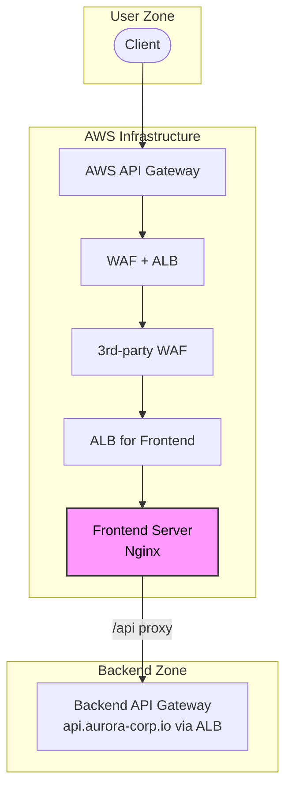

#### **1\. 개요**

간헐적으로 발생하는 API 타임아웃은 원인 파악이 가장 까다로운 장애 유형 중 하나입니다. 이 글에서는 다중 프록시 및 로드밸런서를 거치는 아키텍처의 프론트엔드 서버에서 발생한 간헐적 API 타임아웃의 원인을 분석하고, Nginx의 DNS 해석 방식을 수정하여 문제를 해결한 과정을 회고합니다.

#### **2\. 시스템 아키텍처와 문제 현상**

장애가 발생한 시스템의 트래픽 흐름은 다음과 같이 다층적으로 구성되어 있습니다.(완전히 정확하진 않고 대략 이렇습니다)

`Client -> AWS API Gateway -> WAF ALB -> 3rd-party WAF -> ALB -> Frontend Server(Nginx)`

문제는 이 마지막 단계인 **프론트엔드 서버의 Nginx**에서 발생했습니다. 이 Nginx 서버는 SPA(Single Page Application)의 정적 빌드 파일을 서빙하는 동시에, `/api/*` 경로로 들어오는 모든 요청을 백엔드 API 게이트웨이(자체 ALB, [`api.aurora-corp.io`](http://api.aurora-corp.io) 도메인, 의사 도메인입니다)로 프록시하는 역할을 담당했습니다.

아래는 전체 아키텍처를 도식화한 차트입니다.



**주요 현상:**

* 정적 파일 서빙(`index.html`, JS, CSS 등)은 항상 정상적으로 동작했습니다.
    
* 오직 `/api/*` 경로로 프록시되는 요청 중 일부만 Connection Timeout 에러를 반환했습니다.
    
* 장애는 특정 API에 국한되지 않고 불규칙하게 발생했습니다.
    
* 프론트엔드 Nginx 프로세스를 재시작(`restart` or `reload`)하면 현상이 해소되었습니다.
    

#### **3\. 원인 분석: 정적 DNS 캐싱과 Stale Keep-alive Connection**

초기 장애 분석 단계에서, 문제의 범위를 좁히기 위해 전체 트래픽 경로에 대한 로그를 면밀히 검토했습니다. AWS API Gateway, 각 단계의 WAF 및 ALB, 그리고 최종 백엔드 애플리케이션의 로그까지 확인했지만, **어떤 컴포넌트에서도 지연 시간 증가, 에러 로그, 슬로우 쿼리 등의 유의미한 흔적을 발견할 수 없었습니다.**

모든 백엔드 시스템이 정상적으로 응답하고 있다는 사실은, 장애의 원인이 외부가 아닌 **프론트엔드 Nginx 자체**에 국한되어 있음을 명확히 나타내고 있었습니다. 프론트 재배포로 인한 Nginx 재시작으로 문제가 임시 해결된다는 점을 바탕으로, Nginx의 내부 상태, 특히 백엔드와의 커넥션 관리 방식을 집중적으로 분석했습니다.

핵심 원인은 Nginx의 `upstream` 블록이 동적 클라우드 리소스(ALB)와 상호작용하는 방식에 있었습니다.

1. **Nginx** `upstream`의 DNS 캐싱: 오픈소스 Nginx의 `upstream` 모듈은 설정이 로드되는 시점(시작 또는 리로드)에 단 한 번만 도메인 이름([`api.aurora-corp.io`](http://api.aurora-corp.io))을 IP 주소로 확인(resolve)한다. 그리고 이 IP 주소 목록을 내부 메모리에 캐싱합니다.
    
2. **백엔드 ALB의 동적 IP**: 백엔드 API 게이트웨이 앞단의 ALB는 트래픽, 인스턴스 상태 등에 따라 노드의 IP 주소를 동적으로 변경합니다.
    
3. **Stale Connection 발생**: 프론트엔드 Nginx는 최초에 확인한 백엔드 ALB의 IP 주소 목록을 기반으로 TCP 커넥션 풀(Keep-alive)을 생성하고 유지한다. 시간이 지나 백엔드 ALB의 IP가 변경되면, Nginx의 커넥션 풀에 남아있는 일부 커넥션은 더 이상 유효하지 않은 과거의 IP(Stale IP)를 가리키게 된다.
    

새로운 API 요청이 이 Stale IP를 사용하는 커넥션을 재사용하게 되면, Nginx는 존재하지 않는 엔드포인트에 연결을 시도하다가 결국 `proxy_connect_timeout`에 도달하여 실패합니다. 유효한 커넥션을 할당받은 다른 요청들은 정상 처리되었기 때문에, '간헐적'이고 '일부 API'에서만 타임아웃이 발생하는 것처럼 보인 것입니다.

#### **4\. 해결 방안: 동적 DNS Resolution으로 전환**

이 문제를 해결하기 위해 `upstream` 블록을 제거하고, Nginx가 요청 시점에 DNS를 동적으로 조회하도록 설정을 변경했습니다.

```nginx
# /etc/nginx/conf.d/default.conf

server {
  # 1. Resolver 정의: 신뢰할 수 있는 DNS 서버(VPC 내부 리졸버 등)를 지정.
  resolver 10.110.11.11 valid=30s;

  # 2. 백엔드 호스트를 변수로 선언.
  set $backend_host "api.aurora-corp.io";

  location ~ ^/api/ {
    # 3. proxy_pass에 변수 사용: 변수를 사용하면 Nginx는
    # resolver를 통해 TTL(valid=30s)을 존중하며 DNS를 동적으로 조회한다.
    proxy_pass https://$backend_host$request_uri;
    ...
  }
}
```

`proxy_pass` 지시어에 변수가 포함되면 Nginx는 `upstream`의 정적 캐시 메커니즘을 사용하지 않고, `resolver`를 통해 DNS를 해석합니다. 이로써 백엔드 ALB의 IP 변경에 유연하게 대응할 수 있게 되었다.

#### **5\. 파생 문제 해결 및 최종 설정**

`proxy_pass`에 변수를 사용하는 방식은 세 가지 중요한 부가 설정을 요구합니다.

1. **쿼리스트링 보존**: `proxy_pass https://$backend_host/$1$2$is_args$args`변수 사용 시 쿼리스트링이 누락되므로, `$is_args$args`를 명시하여 보존했습니다
    
2. **SNI(Server Name Indication) 활성화**: `proxy_ssl_server_name on;`
    
    * HTTPS 백엔드 통신 시 TLS 핸드셰이크 오류를 방지하기 위해 SNI를 활성화했습니다.
        
3. **원본 프로토콜 전달**: `proxy_set_header X-Forwarded-Proto $scheme;`
    
    * 다중 프록시 환경에서 원본 프로토콜을 정확하게 전달하도록 수정했습니다.
        

#### **6\. 결론**

복잡한 클라우드 아키텍처에서는 각 컴포넌트의 내부 동작 방식을 정확히 이해하는 것이 중요합니다. 이번 장애는 프론트엔드 서버 Nginx의 DNS 캐싱 정책이 백엔드 ALB의 동적 특성과 맞지 않아 발생한 문제였습니다. 특히, 장애 분석 과정에서 다른 모든 시스템의 정상 동작을 먼저 확인함으로써 문제의 범위를 효과적으로 좁힐 수 있었습니다.

### **마치며**

* 백엔드 엔드포인트가 ALB 등 동적 IP를 사용하는 서비스일 경우, Nginx 오픈소스 버전의 `upstream` 블록 사용은 잠재적 장애 요인이 될 수 있습니다.
    
* `resolver`와 변수를 사용한 동적 DNS 조회는 이러한 환경에 대한 표준적인 해결책입니다.
    
* 하나의 설정을 변경하면 연쇄적으로 고려해야 할 다른 설정(쿼리스트링, SNI 등)이 있음을 인지하고 종합적으로 접근해야 합니다.